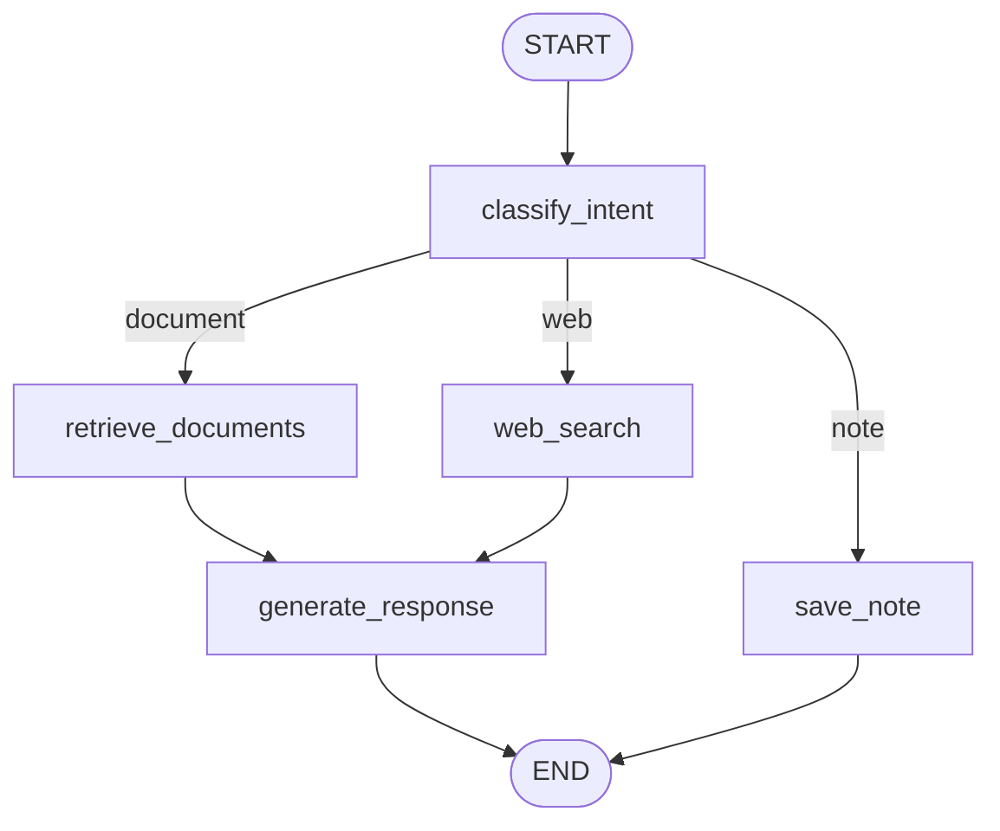

# 📓 NotebookLM Replica

A simplified [NotebookLM](https://notebooklm.google.com/) clone built with **Streamlit + Ollama + LangChain + LangGraph + ChromaDB**.

Built as the **Day 5 Capstone Project** for the Nunnari Academy Generative AI & Agentic AI Bootcamp.

---

## ✨ Features

| Feature | Day Concept | Description |
|---|---|---|
| PDF Upload & Processing | Day 2 | PyPDFLoader + RecursiveCharacterTextSplitter with metadata |
| RAG with Metadata Filtering | Day 3 | ChromaDB vector search filtered by selected documents |
| ReAct Agent with Tools | Day 4 | Document search, web search, and save-note tools |
| LangGraph Workflow | Day 5 | Intent classification → retrieval → response → save |
| 3-Panel UI | Day 1 | Sidebar + Chat + Notes panel |

---

## 🏗️ Architecture

```
User Query
    ↓
classify_intent (LangGraph Node)
    ↓
┌───────────────┬──────────────┬──────────┐
│ document_search│  web_search  │ save_note│
└───────────────┴──────────────┴──────────┘
        ↓               ↓
retrieve_documents   web_search
(ChromaDB)          (Tavily API)
        └───────┬───────┘
          generate_response
          (Ollama llama3.2:3b)
                ↓
              END
```

---

## 🛠️ Tech Stack

| Component | Technology |
|---|---|
| Frontend | Streamlit |
| LLM | Ollama — llama3.2:3b (local, free) |
| Framework | LangChain |
| Vector DB | ChromaDB (persistent, local) |
| Embeddings | Ollama — nomic-embed-text |
| Web Search | Tavily API |
| Orchestration | LangGraph |
| File Storage | Local filesystem |

---

## 🚀 Setup & Run

### 1. Install Ollama

Download from [https://ollama.com](https://ollama.com), then pull the required models:

```bash
ollama pull llama3.2:3b
ollama pull nomic-embed-text
```

Verify Ollama is running:
```bash
curl http://localhost:11434/api/tags
```

### 2. Clone & Install

```bash
git clone https://github.com/YOUR_USERNAME/notebook-lm-replica
cd notebook-lm-replica
pip install -r requirements.txt
```

### 3. Configure Environment

```bash
cp .env.example .env
# Edit .env and add your Tavily API key
```

`.env` contents:
```
TAVILY_API_KEY=tvly-your-key-here
OLLAMA_BASE_URL=http://localhost:11434
```

Get a free Tavily key at [https://tavily.com](https://tavily.com)

### 4. Run

```bash
streamlit run app.py
```

Open [http://localhost:8501](http://localhost:8501) in your browser.

---

## 📁 Project Structure

```
notebook-lm/
├── app.py                    # Main Streamlit application
├── config.py                 # Central configuration
├── requirements.txt
├── .env.example
├── components/
│   ├── sidebar.py            # PDF upload, document list, settings
│   ├── chat.py               # Chat interface + LangGraph invocation
│   └── notes.py              # Saved notes panel
├── core/
│   ├── prompts.py            # All LLM prompts
│   ├── document_processor.py # PDF loading + chunking + metadata
│   ├── vector_store.py       # ChromaDB operations
│   ├── rag_chain.py          # RAG retrieval + answer generation
│   ├── agents.py             # ReAct agent + tools
│   └── graph.py              # LangGraph workflow
├── storage/
│   ├── uploads/              # Uploaded PDF files
│   ├── chroma_db/            # ChromaDB persistent storage
│   └── notes/                # Saved markdown notes
└── utils/
    └── helpers.py            # Utility functions
```

---

## 💡 How to Use

1. **Upload PDFs** — drag and drop in the sidebar
2. **Select documents** — check the boxes next to documents you want to search
3. **Ask questions** — type in the chat box
4. **Enable web search** — toggle in settings for real-time info
5. **Save notes** — click 💾 Save on any assistant response
6. **Download notes** — use the Download All Notes button in the notes panel

---

## 🔀 LangGraph Diagram



---

## 📚 Concepts Applied

- **Day 1** — Persona prompting in `core/prompts.py` (RAG, web, intent prompts)
- **Day 2** — Document loaders in `core/document_processor.py` (PyPDFLoader + chunking)
- **Day 3** — RAG with metadata filtering in `core/vector_store.py` + `core/rag_chain.py`
- **Day 4** — ReAct agent with tools in `core/agents.py`
- **Day 5** — LangGraph orchestration in `core/graph.py`
